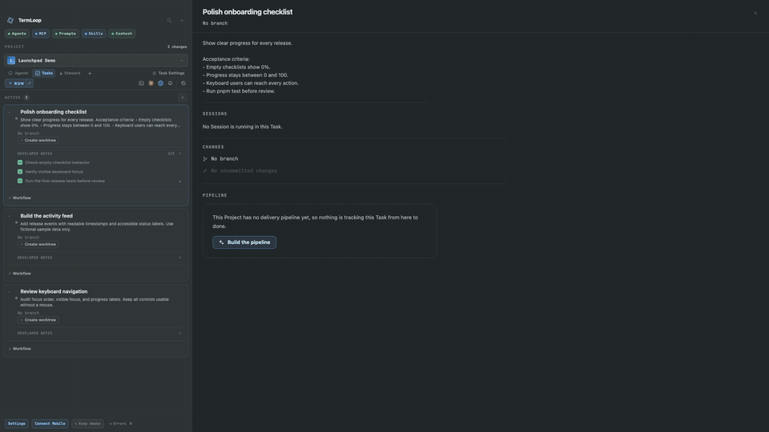

<h1 align="center">TermLoop</h1>

<p align="center">
  <strong>Keep every coding agent in the loop.</strong><br>
  Run Claude Code, Codex, and terminals in one workspace.<br>
  Give agents context, ask for a second opinion, and keep the work connected.
</p>

<p align="center">
  <a href="https://github.com/feritzcan2/termloop/releases/latest"><strong>Download TermLoop</strong></a> ·
  <a href="https://termloop.ai">Website</a> ·
  <a href="docs/features.md">Documentation</a> ·
  <a href="docs/development.md">Build from source</a>
</p>

Six short loops from a populated demo Project. Click a preview for the 1080p video, playback controls and written steps.

### Ask To — Get a second opinion without copy-paste.

Ask one agent to consult another agent. TermLoop creates a visible helper Session, preserves the relationship, and returns the answer to the requester.

<a href="https://termloop.ai/#ask-to"></a>

### Handoff — Move context to the agent already in the work.

Send a visible, composed handoff from one running Project Session to another. The target receives the brief in its own real terminal and continues from there.

<a href="https://termloop.ai/#handoff"></a>

### Session Fork — Explore another direction in a real terminal.

Fork a Session from the sidebar, see the parent-child relationship, and continue in a new Ghostty terminal. The branch in thinking is explicit instead of becoming another anonymous tab.

<a href="https://termloop.ai/#fork"></a>

### Tasks — Keep the goal beside the work.

Keep a clear brief, acceptance criteria and a small checklist attached to each Task.

<a href="https://termloop.ai/#task-briefs"></a>

### Task Worktrees — Give each change its own workspace.

Create a branch and managed worktree directly from a Task. Keep parallel changes in separate checkouts.

<a href="https://termloop.ai/#task-worktrees"></a>

### Code review — Review changes where they happened.

Read the diff, compare versions side by side and keep track of the files you have checked.

<a href="https://termloop.ai/#full-file-review"></a>

Also included: multiple live agents, mobile terminal access, Project Steward, reusable workflows, Context Bank, skills, MCP tools and notifications. Explore the [complete feature guide](docs/features.md).

The GIFs follow the same timing as the website videos, with visible clicks and smoothly accelerated waits. Website demos loop silently when visible and respect reduced-motion preferences.

## Start using TermLoop

1. Download an installer from [Releases](https://github.com/feritzcan2/termloop/releases/latest). Release **v2.0.4** includes a universal macOS build and Linux AppImage / Debian packages. Choose from the assets actually listed for your platform; this release does not include a Windows desktop installer.
2. Open TermLoop and add a **Project** pointing at your repository or local folder.
3. Start a Claude Code or Codex Session using your provider account, or open an ordinary terminal. Agent CLIs need to be installed and authenticated on the computer running them.
4. Create a **Task** with the change you want and its acceptance criteria. Provision a Task worktree when the change needs its own branch and checkout.
5. Run the work, inspect its changes, and ask another agent for a review before deciding what to keep.

TermLoop uses your existing coding-agent subscriptions and provider sign-ins. A Project can contain several live Sessions, and a Task remains useful without a worktree.

## Projects, Tasks, and Sessions

- **Project:** the durable scope around a repository or folder, its configuration, Tasks, and Sessions.
- **Task:** a unit of work with a brief and developer notes. It can use an optional managed Git worktree. Closing, archiving, and restoring have separate purposes.
- **Session:** a real running agent, shell, or configured command. The daemon owns its PTY and process; client windows display and attach to it.

Ask To creates a tracked helper request. Handoff targets an existing Session. Fork creates a separate conversation; it does not by itself create a Git worktree. See the [coordination guide](docs/features.md#coordinate) for the individual steps.

## Develop from source

Use **Rust 1.90.0**, **Node.js 22+**, and **pnpm 10.14.0**. Native desktop prerequisites depend on the host; macOS also needs Xcode, Python 3, and **Zig 0.15.2** for the Ghostty host.

```sh
git clone --recurse-submodules https://github.com/feritzcan2/termloop.git
cd termloop
git switch develop
pnpm install --frozen-lockfile
pnpm codegen
```

Then follow the [development guide](docs/development.md) to launch an isolated profile, build a package, or run the checks relevant to your change. There is no single repository-wide application build command.

## Architecture

The Rust daemon owns PTYs, process lifecycles, and durable state. Generated contracts serve Electron, the CLI, Companion, and remote clients through separate control and terminal data paths. Git operations, provider integrations, and persistence have explicit module owners.

See the [repository map](docs/development.md#repository-map), [contract schemas](contract/schema), and boundary-specific `AGENTS.md` files for the engineering contracts.

## Contribute

Use `develop` for day-to-day changes and read the nearest `AGENTS.md` before editing. Keep changes focused, preserve unrelated work, and include the relevant validation results in a pull request. Report bugs with your OS, app version, reproduction steps, and the observed behavior in [Issues](https://github.com/feritzcan2/termloop/issues).

## License

TermLoop is dual-licensed under **GPL-3.0-or-later** and a commercial license. See [LICENSE](LICENSE); commercial licensing enquiries can be sent to [feritzcan93@gmail.com](mailto:feritzcan93@gmail.com).
