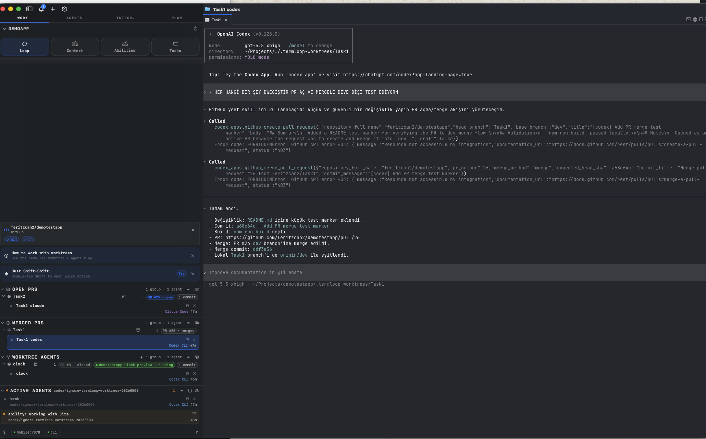
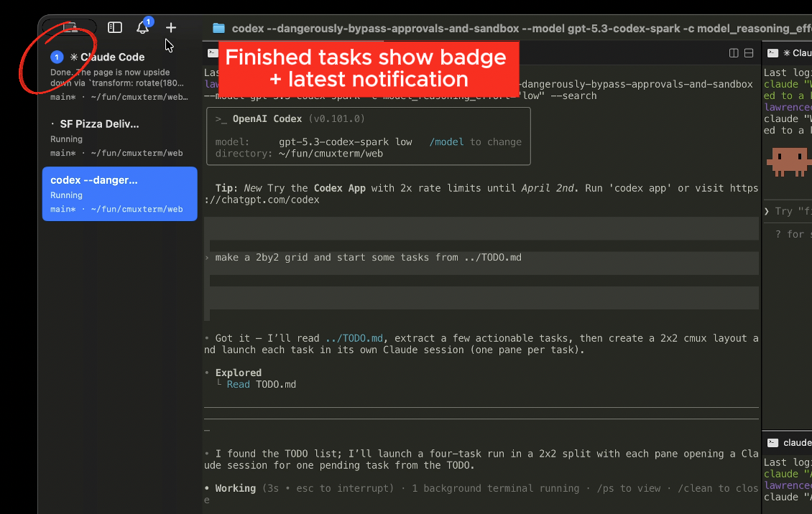

<p align="center">
  
</p>

<h1 align="center">TermLoop</h1>
<p align="center">A native macOS terminal with vertical tabs and notifications for AI coding agents</p>

<p align="center">
  <a href="https://github.com/feritzcan2/termloop/releases/latest/download/termloop-macos.dmg">
    
  </a>
</p>

<p align="center">
  <a href="https://github.com/feritzcan2/termloop/discussions"></a>
  <a href="https://github.com/feritzcan2/termloop"></a>
</p>

<p align="center">
  
</p>

<p align="center">
  <a href="https://www.youtube.com/watch?v=i-WxO5YUTOs">▶ Demo video</a>
</p>

## Features

<table>
<tr>
<td width="40%" valign="middle">
<h3>Parallel worktree agents</h3>
Hand four agents four tasks at once. Each runs in its own <code>.termloop-worktrees/&lt;branch&gt;</code>, boots its own dev server, opens its own PR. Your host checkout stays clean.
</td>
<td width="60%">

</td>
</tr>
<tr>
<td width="40%" valign="middle">
<h3>Notification rings</h3>
Panes get a blue ring and tabs light up when coding agents need your attention
</td>
<td width="60%">

</td>
</tr>
<tr>
<td width="40%" valign="middle">
<h3>Notification panel</h3>
See all pending notifications in one place, jump to the most recent unread
</td>
<td width="60%">

</td>
</tr>
<tr>
<td width="40%" valign="middle">
<h3>In-app browser</h3>
Split a browser alongside your terminal with a scriptable API ported from <a href="https://github.com/vercel-labs/agent-browser">agent-browser</a>
</td>
<td width="60%">

</td>
</tr>
<tr>
<td width="40%" valign="middle">
<h3>Vertical + horizontal tabs</h3>
Sidebar shows git branch, linked PR status/number, working directory, listening ports, and latest notification text. Split horizontally and vertically.
</td>
<td width="60%">

</td>
</tr>
<tr>
<td width="40%" valign="middle">
<h3>SSH</h3>
<code>termloop ssh user@remote</code> creates a workspace for a remote machine. Browser panes route through the remote network so localhost just works. Drag an image into a remote session to upload via scp.
</td>
<td width="60%">

</td>
</tr>
<tr>
<td width="40%" valign="middle">
<h3>Claude Code Teams</h3>
<code>termloop claude-teams</code> runs Claude Code's teammate mode with one command. Teammates spawn as native splits with sidebar metadata and notifications. No tmux required.
</td>
<td width="60%">

</td>
</tr>
</table>

- **Browser import** — Import cookies, history, and sessions from Chrome, Firefox, Arc, and 20+ browsers so browser panes start authenticated
- **Custom commands** — Define project-specific actions in [`termloop.json`](https://termloop.ai/docs/custom-commands) that launch from the command palette
- **Scriptable** — CLI and socket API to create workspaces, split panes, send keystrokes, and automate the browser
- **Native macOS app** — Built with Swift and AppKit, not Electron. Fast startup, low memory.
- **GPU-accelerated rendering** — Smooth output even at high refresh rates

## Install

### DMG (recommended)

<a href="https://github.com/feritzcan2/termloop/releases/latest/download/termloop-macos.dmg">
  
</a>

Open the `.dmg` and drag TermLoop to your Applications folder. TermLoop auto-updates via Sparkle, so you only need to download once.

### Homebrew

```bash
brew tap feritzcan2/termloop
brew install --cask termloop
```

To update later:

```bash
brew upgrade --cask termloop
```

On first launch, macOS may ask you to confirm opening an app from an identified developer. Click **Open** to proceed.

## Why TermLoop?

I run a lot of Claude Code and Codex sessions in parallel. I was using a stock terminal with a bunch of split panes, and relying on native macOS notifications to know when an agent needed me. But Claude Code's notification body is always just "Claude is waiting for your input" with no context, and with enough tabs open I couldn't even read the titles anymore.

I tried a few coding orchestrators but most of them were Electron/Tauri apps and the performance bugged me. I also just prefer the terminal since GUI orchestrators lock you into their workflow. So I built TermLoop as a native macOS app in Swift/AppKit.

The main additions are the sidebar and notification system. The sidebar has vertical tabs that show git branch, linked PR status/number, working directory, listening ports, and the latest notification text for each workspace. The notification system picks up terminal sequences (OSC 9/99/777) and has a CLI (`termloop notify`) you can wire into agent hooks for Claude Code, OpenCode, etc. When an agent is waiting, its pane gets a blue ring and the tab lights up in the sidebar, so I can tell which one needs me across splits and tabs. Cmd+Shift+U jumps to the most recent unread.

The in-app browser has a scriptable API ported from [agent-browser](https://github.com/vercel-labs/agent-browser). Agents can snapshot the accessibility tree, get element refs, click, fill forms, and evaluate JS. You can split a browser pane next to your terminal and have Claude Code interact with your dev server directly.

Everything is scriptable through the CLI and socket API — create workspaces/tabs, split panes, send keystrokes, open URLs in the browser.

## The Zen of TermLoop

TermLoop is not prescriptive about how developers hold their tools. It's a terminal and browser with a CLI, and the rest is up to you.

TermLoop is a primitive, not a solution. It gives you a terminal, a browser, notifications, workspaces, splits, tabs, and a CLI to control all of it. TermLoop doesn't force you into an opinionated way to use coding agents. What you build with the primitives is yours.

The best developers have always built their own tools. Nobody has figured out the best way to work with agents yet, and the teams building closed products definitely haven't either. The developers closest to their own codebases will figure it out first.

Give a million developers composable primitives and they'll collectively find the most efficient workflows faster than any product team could design top-down.

## Documentation

For more info on how to configure TermLoop, [head over to our docs](https://termloop.ai/docs/getting-started?utm_source=readme).

## Telemetry

TermLoop ships with crash reporting disabled by default.

- Enable it from `Settings → App` if you want anonymized crash and app-hang reporting.
- Performance tracing and usage analytics stay disabled.
- Crash reports are configured with `sendDefaultPii = false`; file paths, document names, URL query strings, cookies, headers, screenshots, and view hierarchies are stripped before events are sent.
- Document contents and terminal contents are not sent as part of crash reporting.

## Keyboard Shortcuts

### Workspaces

| Shortcut | Action |
|----------|--------|
| ⌘ N | New workspace |
| ⌘ 1–8 | Jump to workspace 1–8 |
| ⌘ 9 | Jump to last workspace |
| ⌃ ⌘ ] | Next workspace |
| ⌃ ⌘ [ | Previous workspace |
| ⌘ ⇧ W | Close workspace |
| ⌘ ⇧ R | Rename workspace |
| ⌘ B | Toggle sidebar |

### Surfaces

| Shortcut | Action |
|----------|--------|
| ⌘ T | New surface |
| ⌘ ⇧ ] | Next surface |
| ⌘ ⇧ [ | Previous surface |
| ⌃ Tab | Next surface |
| ⌃ ⇧ Tab | Previous surface |
| ⌃ 1–8 | Jump to surface 1–8 |
| ⌃ 9 | Jump to last surface |
| ⌘ W | Close surface |

### Split Panes

| Shortcut | Action |
|----------|--------|
| ⌘ D | Split right |
| ⌘ ⇧ D | Split down |
| ⌥ ⌘ ← → ↑ ↓ | Focus pane directionally |
| ⌘ ⇧ H | Flash focused panel |

### Browser

Browser developer-tool shortcuts follow Safari defaults and are customizable in `Settings → Keyboard Shortcuts`.

| Shortcut | Action |
|----------|--------|
| ⌘ ⇧ L | Open browser in split |
| ⌘ L | Focus address bar |
| ⌘ [ | Back |
| ⌘ ] | Forward |
| ⌘ R | Reload page |
| ⌥ ⌘ I | Toggle Developer Tools (Safari default) |
| ⌥ ⌘ C | Show JavaScript Console (Safari default) |

### Notifications

| Shortcut | Action |
|----------|--------|
| ⌘ I | Show notifications panel |
| ⌘ ⇧ U | Jump to latest unread |

### Find

| Shortcut | Action |
|----------|--------|
| ⌘ F | Find |
| ⌘ G / ⌘ ⇧ G | Find next / previous |
| ⌘ ⇧ F | Hide find bar |
| ⌘ E | Use selection for find |

### Terminal

| Shortcut | Action |
|----------|--------|
| ⌘ K | Clear scrollback |
| ⌘ C | Copy (with selection) |
| ⌘ V | Paste |
| ⌘ + / ⌘ - | Increase / decrease font size |
| ⌘ 0 | Reset font size |

### Window

| Shortcut | Action |
|----------|--------|
| ⌘ ⇧ N | New window |
| ⌘ , | Settings |
| ⌘ ⇧ , | Reload configuration |
| ⌘ Q | Quit |

## Nightly Builds

[Download TermLoop NIGHTLY](https://github.com/feritzcan2/termloop/releases/download/nightly/termloop-nightly-macos.dmg)

TermLoop NIGHTLY is a separate app with its own bundle ID, so it runs alongside the stable version. Built automatically from the latest `main` commit and auto-updates via its own Sparkle feed.

Report nightly bugs on [GitHub Issues](https://github.com/feritzcan2/termloop/issues) or in [Discussions](https://github.com/feritzcan2/termloop/discussions).

## Session restore (current behavior)

On relaunch, TermLoop currently restores app layout and metadata only:
- Window/workspace/pane layout
- Working directories
- Terminal scrollback (best effort)
- Browser URL and navigation history

TermLoop does **not** restore live process state inside terminal apps. For example, active Claude Code/tmux/vim sessions are not resumed after restart yet.

## Star History

<a href="https://star-history.com/#feritzcan2/termloop&Date">
 <picture>
   <source media="(prefers-color-scheme: dark)" srcset="https://api.star-history.com/svg?repos=feritzcan2/termloop&type=Date&theme=dark" />
   <source media="(prefers-color-scheme: light)" srcset="https://api.star-history.com/svg?repos=feritzcan2/termloop&type=Date" />
   
 </picture>
</a>

## Contributing

Ways to get involved:

- Join the conversation on [Discussions](https://github.com/feritzcan2/termloop/discussions)
- Open and participate in [GitHub Issues](https://github.com/feritzcan2/termloop/issues)
- Let us know what you're building with TermLoop

See [`termloop/CONTRIBUTING.md`](termloop/CONTRIBUTING.md) for development setup.

## Founder's Edition

TermLoop is free, open source, and always will be. If you'd like to support development and get early access to what's coming next:

**[Get Founder's Edition](https://buy.stripe.com/3cI00j2Ld0it5OU33r5EY0q)**

- **Prioritized feature requests/bug fixes**
- **Early access: TermLoop AI that gives you context on every workspace, tab and panel**
- **Early access: iOS app with terminals synced between desktop and phone**
- **Early access: Cloud VMs**
- **Early access: Voice mode**
- **My personal iMessage/WhatsApp**

## License

TermLoop is open source under [GPL-3.0-or-later](LICENSE). Third-party components are listed in [`NOTICE`](NOTICE).

If your organization cannot comply with GPL, a commercial license is available. Contact [feritzcan93@gmail.com](mailto:feritzcan93@gmail.com) for details.
