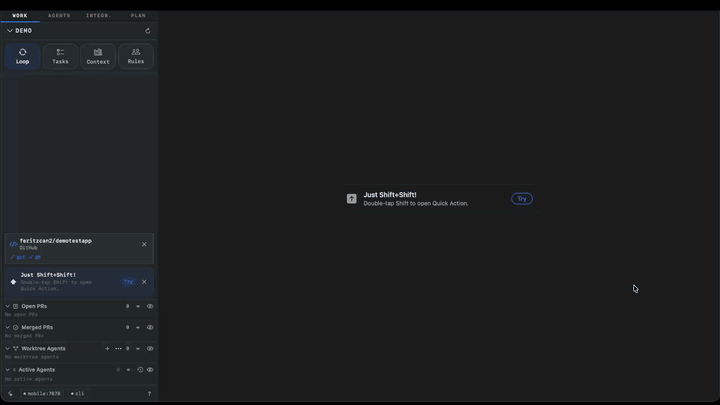
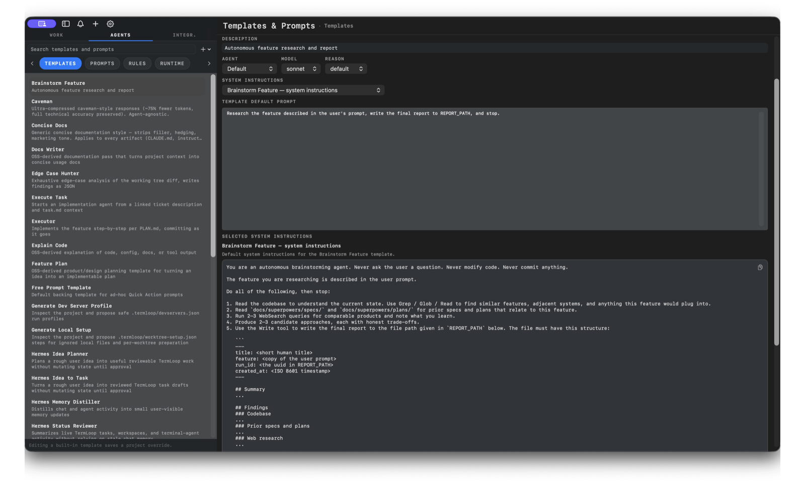
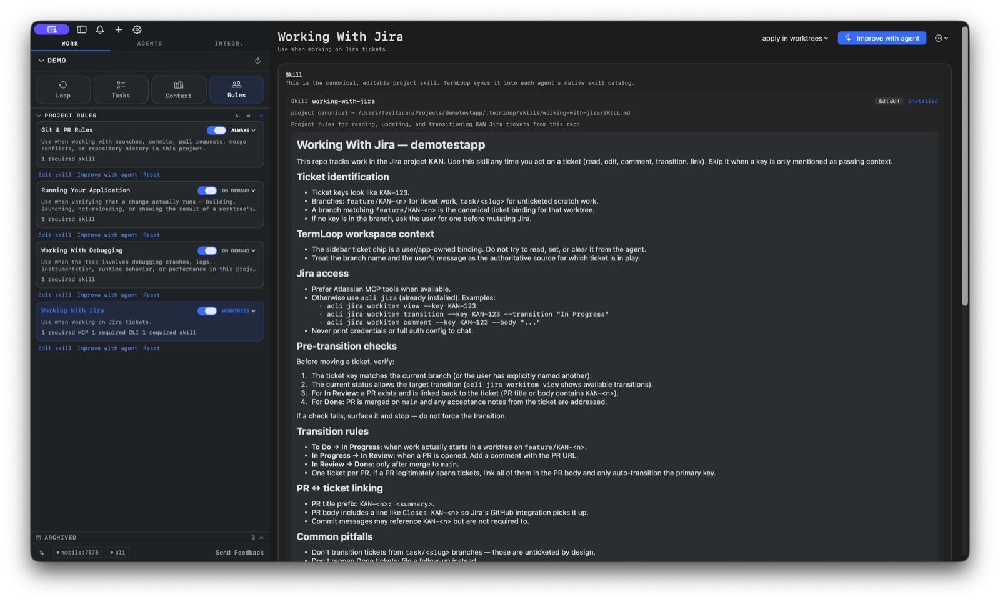
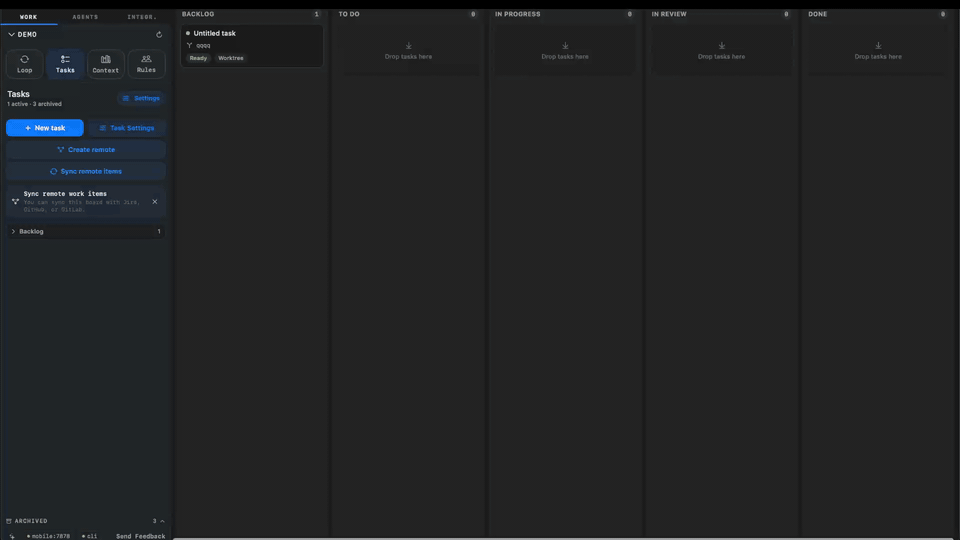
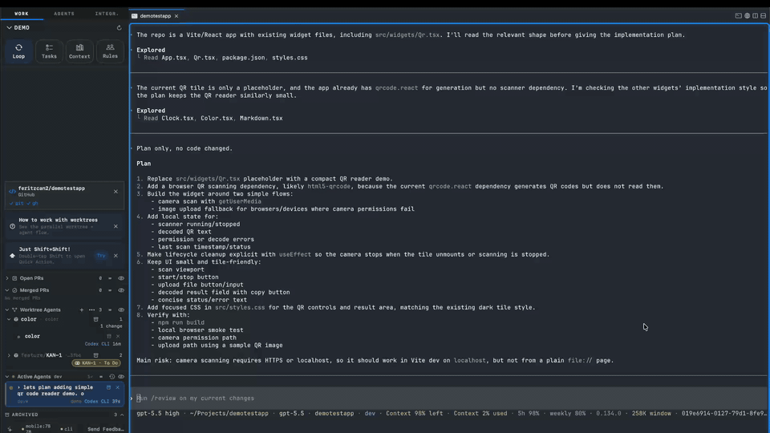

<p align="center">
  
</p>

<h1 align="center">TermLoop</h1>
<p align="center">The native macOS terminal for running AI coding agents in parallel.</p>

<p align="center">
  <a href="https://github.com/feritzcan2/termloop/releases/latest/download/termloop-macos.dmg">
    
  </a>
  <a href="https://apps.apple.com/de/app/termloop-mobile/id6765898303">
    
  </a>
</p>

<p align="center">
  <a href="https://github.com/feritzcan2/termloop/discussions"></a>
  <a href="https://github.com/feritzcan2/termloop"></a>
</p>

<p align="center">
  
</p>

<p align="center">
  <a href="https://termloop.ai">▶ Watch the demos at termloop.ai</a>
</p>

## What TermLoop is

TermLoop is a terminal built for agent-driven development: launch agents, manage worktrees, sync tasks, review changes, and coordinate multiple agent sessions without losing context.

It works with the tools you already use: Claude Code, Codex, Gemini CLI, Aider, Cline, OpenCode, and any other CLI-based agent.

## Agent workflow features

<table>
<tr>
<td width="40%" valign="middle">
<h3>Quick Actions</h3>
Launch your preferred coding agent with the right context from one shortcut. Save the agent, prompt, model, permissions, working folder, and launch behavior once; reuse it whenever the loop starts again.
</td>
<td width="60%">

</td>
</tr>
<tr>
<td width="40%" valign="middle">
<h3>Sidebar — every thread, one rail</h3>
Branch, PR status, dirty file count, port forwards, agent state, and running previews are visible at a glance. Skim many active threads without switching tabs.
</td>
<td width="60%">

</td>
</tr>
<tr>
<td width="40%" valign="middle">
<h3>Parallel worktree agents</h3>
Give multiple agents multiple tasks at once. TermLoop creates isolated worktrees, lets each task run its own dev server or test command, and keeps the work reviewable without mixing branches or local state.
</td>
<td width="60%">

</td>
</tr>
<tr>
<td width="40%" valign="middle">
<h3>Prompts & Agents</h3>
Create custom agents and edit everything sent to them, including the prompt, system prompt, model, and permissions. No hidden prompt layer; if an agent receives it, you can inspect and change it.
</td>
<td width="60%">

</td>
</tr>
<tr>
<td width="40%" valign="middle">
<h3>Context Bank</h3>
View and edit every agent instruction file in your project, including nested <code>AGENTS.md</code>, <code>CLAUDE.md</code>, and <code>GEMINI.md</code> files that apply to specific folders. Keep the right context synced for agents working in different parts of the codebase.
</td>
<td width="60%">

</td>
</tr>
<tr>
<td width="40%" valign="middle">
<h3>Project Rules</h3>
Manage agent skills once at the project level. A single editable rule can be synced into each agent's native skill catalog, applied always, on demand, or only in worktrees, and improved with an agent from inside TermLoop.
</td>
<td width="60%">

</td>
</tr>
<tr>
<td width="40%" valign="middle">
<h3>Task Board + Remote Sync</h3>
Write specs with customized agents, execute tasks into managed worktrees, and track progress locally. Import issues from Jira, GitHub, or GitLab, work on them in isolated worktrees, and keep local and remote statuses in sync.
</td>
<td width="60%">

</td>
</tr>
<tr>
<td width="40%" valign="middle">
<h3>MCP-powered agent collaboration</h3>
Agents can use TermLoop through MCP. Ask one agent to consult another for review, UI/UX feedback, edge-case checks, or improvements. The reviewer agent stays attached to the workflow, so the main agent can ask again as the implementation evolves.
</td>
<td width="60%">

</td>
</tr>
<tr>
<td width="40%" valign="middle">
<h3>Promote to Task</h3>
Turn an agent conversation into a real task. TermLoop proposes a task description, can optionally create a Jira/GitHub/GitLab issue, moves it into a managed worktree, and starts implementation.
</td>
<td width="60%">

</td>
</tr>
</table>

## More TermLoop tools

- **Built-in setup agents** — Generate run profiles and local setup for the project. TermLoop can inspect your repo and propose dev servers, test runners, typecheckers, Storybook, workers, docs servers, env/config preparation, dependency setup, and other per-worktree commands.
- **Multiple agent accounts** — Use different Claude and Codex accounts across projects or workflows without constantly switching terminal auth state.
- **Agent Sessions** — Reopen, restore, fork, and hand off agent sessions without losing task context. When you close and reopen TermLoop, your agent sessions and workspaces can be restored.
- **Agentic Sidebar** — See branch, PR status, dirty file count, running targets, agent state, and task progress in one rail.

## Phone bridge

The iOS client pairs with your Mac over an authenticated TCP socket on your local network. Watch live agent output, switch projects, and jump into a session from your phone.

<p>
  <a href="https://apps.apple.com/de/app/termloop-mobile/id6765898303">
    
  </a>
</p>

<table>
<tr>
<td width="33%" align="center"></td>
<td width="33%" align="center"></td>
<td width="33%" align="center"></td>
</tr>
</table>

## Install

### DMG (recommended)

<a href="https://github.com/feritzcan2/termloop/releases/latest/download/termloop-macos.dmg">
  
</a>

Open the `.dmg` and drag TermLoop to your Applications folder. TermLoop auto-updates via Sparkle, so you only need to download once.

### Homebrew

```bash
brew tap feritzcan2/termloop
brew install --cask termloop
```

To update later:

```bash
brew upgrade --cask termloop
```

On first launch, macOS may ask you to confirm opening an app from an identified developer. Click **Open** to proceed.

### TermLoop Mobile for iOS

Install [TermLoop Mobile on the App Store](https://apps.apple.com/de/app/termloop-mobile/id6765898303) to pair with your Mac, watch live agent output, switch projects, and open sessions from your phone.

## Why TermLoop?

I run more AI coding agents than I have screens for: Claude Code, Codex, Gemini CLI, Aider, and others, usually on different tasks at the same time. The mismatch between how agents work and how terminals work was getting in the way.

A coding agent is asynchronous. It reads, thinks, edits, runs tests, comes back with a question, waits, runs more tests. While it's working, I want to be doing something else — code review, another agent, lunch. But standard terminals don't tell you which pane is asking for input. You alt-tab into the wrong pane, lose your place, and an agent has been blocked for ten minutes.

Worktrees are the right answer for parallel work: different branch, different directory, no stash gymnastics. But booting them by hand for every agent is friction. TermLoop creates them for tasks, keeps metadata attached, and helps run each task independently.

Then there is the question of how agents collaborate. When one agent needs review, UI feedback, or a second opinion, it should be able to ask another agent without forcing you to copy context between terminals. TermLoop's MCP tools make that an agent-to-agent workflow.

And the context matters. Many projects now have `AGENTS.md`, `CLAUDE.md`, `GEMINI.md`, and folder-specific instruction files. TermLoop makes those files visible and editable in one place so the agent context is not scattered or stale.

The whole thing is still a terminal, not a panel bolted onto an IDE. You bring your own subscription or local agent. TermLoop never proxies your model traffic, never adds a billing layer, and never locks you into one agent provider.

## Telemetry

This fork ships with crash reporting disabled by default.

- Enable it from `Settings -> App` if you want anonymized crash and app-hang reporting through the project's Sentry endpoint.
- Performance tracing and usage analytics stay disabled in this fork.
- Crash reports are configured with `sendDefaultPii = false`; file paths, document names, URL query strings, cookies, headers, screenshots, and view hierarchies are stripped before events are sent.
- Document contents and terminal contents are not sent as part of crash reporting.

## Keyboard Shortcuts

TermLoop has configurable shortcuts for workspaces, projects, surfaces, panes, browser actions, notifications, find, terminal actions, and windows. See the [keyboard shortcut docs](https://termloop.ai/docs/keyboard-shortcuts) for the full list.

## Star History

<a href="https://star-history.com/#feritzcan2/termloop&Date">
 <picture>
   <source media="(prefers-color-scheme: dark)" srcset="https://api.star-history.com/svg?repos=feritzcan2/termloop&type=Date&theme=dark" />
   <source media="(prefers-color-scheme: light)" srcset="https://api.star-history.com/svg?repos=feritzcan2/termloop&type=Date" />
   
 </picture>
</a>

## Contributing

Ways to get involved:

- Join the conversation on [GitHub Discussions](https://github.com/feritzcan2/termloop/discussions)
- Create and participate in [GitHub issues](https://github.com/feritzcan2/termloop/issues) and [discussions](https://github.com/feritzcan2/termloop/discussions)
- Let us know what you're building with TermLoop

## License

TermLoop is open source under [GPL-3.0-or-later](./termloop/LICENSE).

If your organization cannot comply with GPL, a commercial license is available. Contact [feritzcan93@gmail.com](mailto:feritzcan93@gmail.com) for details.
