<p align="center">
  
</p>

<h1 align="center">TermLoop</h1>
<p align="center">The terminal IDE for your AI agents — Claude Code, Codex, Gemini CLI, Aider, Cline, in parallel.</p>

<p align="center">
  <a href="https://github.com/feritzcan2/termloop/releases/latest/download/termloop-macos.dmg">
    
  </a>
</p>

<p align="center">
  <a href="https://github.com/feritzcan2/termloop/discussions"></a>
  <a href="https://github.com/feritzcan2/termloop"></a>
</p>

<p align="center">
  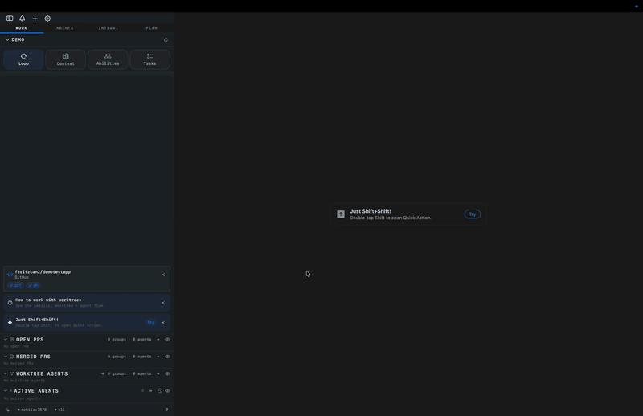
</p>

<p align="center">
  <a href="https://termloop.ai">▶ Watch the demos at termloop.ai</a>
</p>

## What TermLoop adds

The agent-loop layer — what makes TermLoop different from a plain terminal multiplexer.

<table>
<tr>
<td width="40%" valign="middle">
<h3>Parallel worktree agents</h3>
Hand four agents four tasks at once. Each runs in its own <code>.termloop-worktrees/&lt;branch&gt;</code>, boots its own dev server, opens its own PR. Your host checkout stays clean.
</td>
<td width="60%">
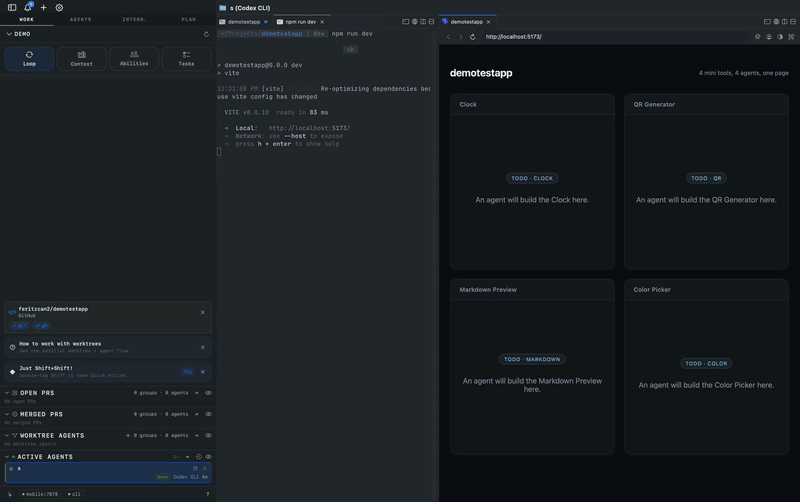
</td>
</tr>
<tr>
<td width="40%" valign="middle">
<h3>Quick Actions — all your agents in one tap</h3>
Save an agent launch — name, prompt, model, even a starter command. One tap fires the whole set. No copy-pasting prompts, no per-agent setup.
</td>
<td width="60%">

</td>
</tr>
<tr>
<td width="40%" valign="middle">
<h3>Cross-agent consults via <code>ask_to</code></h3>
When one agent gets stuck, it doesn't wait for you. The built-in <code>ask_to</code> MCP tool lets it consult any other running agent — different model, different worktree. Cross-pollination, no human in the loop.
</td>
<td width="60%">
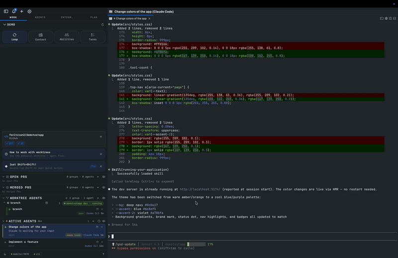
</td>
</tr>
<tr>
<td width="40%" valign="middle">
<h3>Context Bank — shared, scored context</h3>
TermLoop catalogs every <code>CLAUDE.md</code>, <code>AGENTS.md</code>, <code>GEMINI.md</code> across your tree, scores how much each one actually helps, and lets you clone the strong ones into other agents.
</td>
<td width="60%">
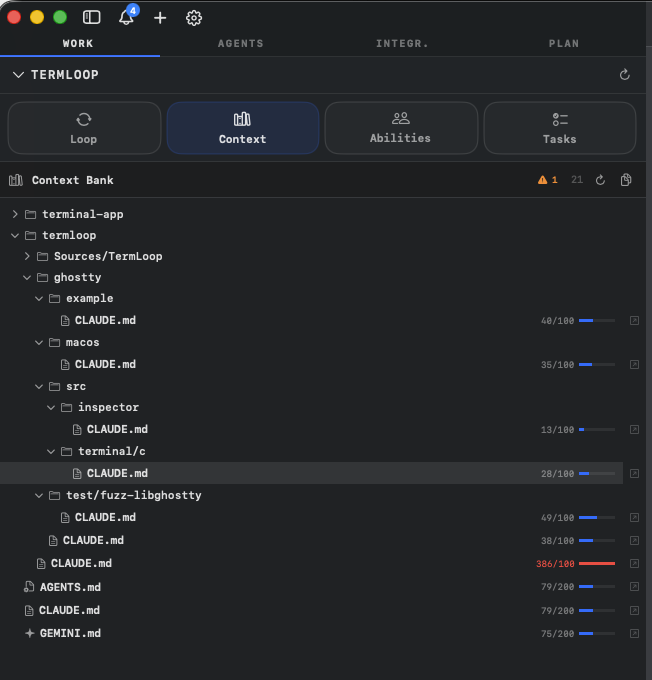
</td>
</tr>
<tr>
<td width="40%" valign="middle">
<h3>Per-project Claude account</h3>
Bind a different Claude login to each project — work in one, personal in another. No terminal switching, no token juggling.
</td>
<td width="60%">
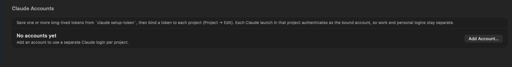
</td>
</tr>
<tr>
<td width="40%" valign="middle">
<h3>Sidebar — every thread, one rail</h3>
Branch, PR status, dirty file count, port forwards, agent state — every workspace at a glance. Skim ten active threads without switching tabs.
</td>
<td width="60%">
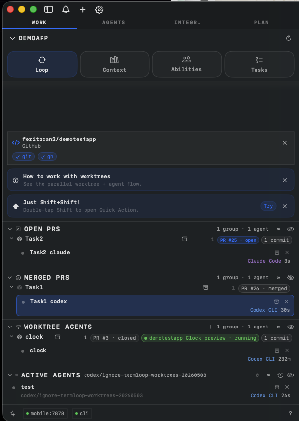
</td>
</tr>
</table>

## Phone bridge — your sessions, in your pocket

Native iOS client pairs with your Mac over an authenticated TCP socket on your local network. Watch live agent output, switch projects, jump into a session — from the couch, the queue, or another room. Stable today; still under active development.

<table>
<tr>
<td width="33%" align="center">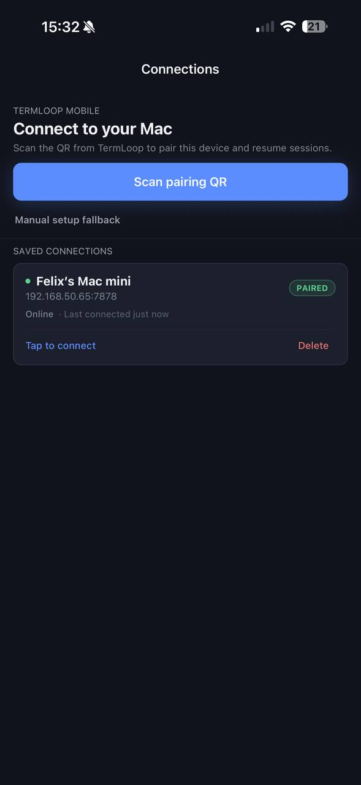</td>
<td width="33%" align="center">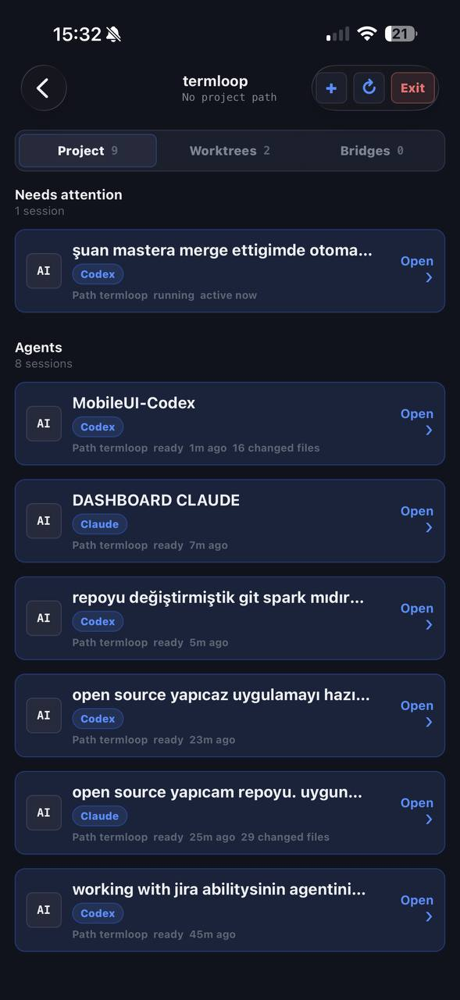</td>
<td width="33%" align="center">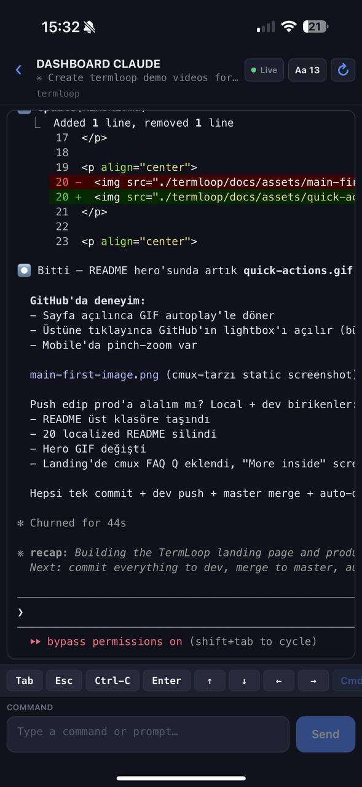</td>
</tr>
</table>

## Built on the cmux foundation

TermLoop builds on [cmux](https://github.com/manaflow-ai/cmux), an open-source GPL-3.0 terminal multiplexer by Manaflow. cmux gives us the multiplexer foundation — splits, panes, the renderer. The features below come from there:

<table>
<tr>
<td width="40%" valign="middle">
<h3>Notification rings</h3>
Panes get a blue ring and tabs light up when coding agents need your attention.
</td>
<td width="60%">
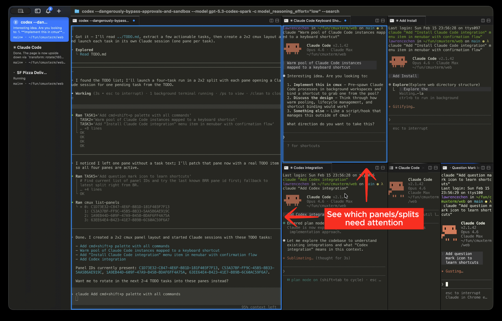
</td>
</tr>
<tr>
<td width="40%" valign="middle">
<h3>In-app browser</h3>
Split a browser alongside your terminal with a scriptable API ported from <a href="https://github.com/vercel-labs/agent-browser">agent-browser</a>.
</td>
<td width="60%">
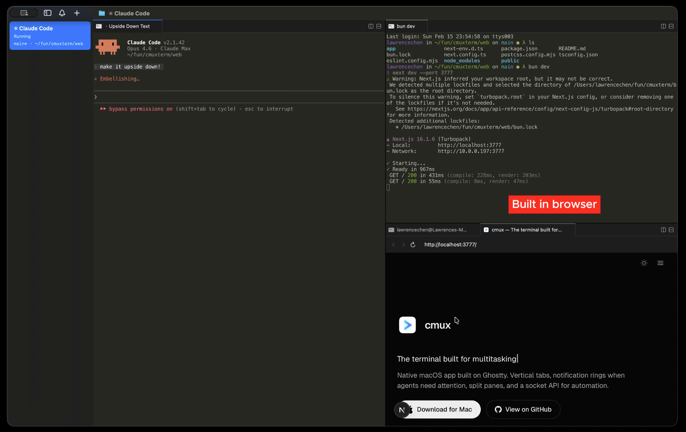
</td>
</tr>
<tr>
<td width="40%" valign="middle">
<h3>Vertical + horizontal tabs</h3>
Sidebar shows git branch, linked PR status/number, working directory, listening ports, and latest notification text. Split horizontally and vertically.
</td>
<td width="60%">
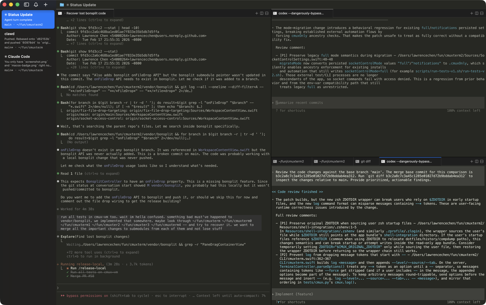
</td>
</tr>
<tr>
<td width="40%" valign="middle">
<h3>SSH workspaces</h3>
<code>termloop ssh user@remote</code> creates a workspace for a remote machine. Browser panes route through the remote network so localhost just works. Drag an image into a remote session to upload via scp.
</td>
<td width="60%">
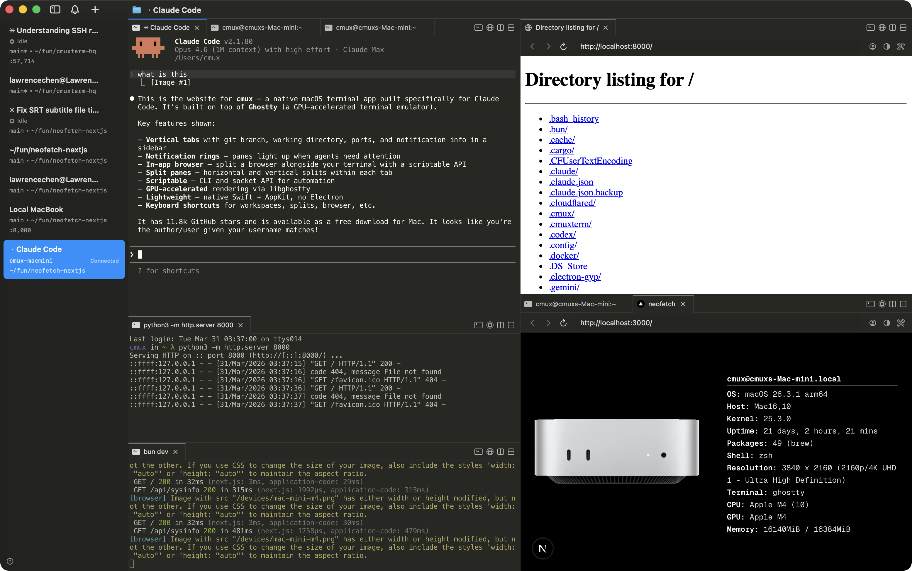
</td>
</tr>
<tr>
<td width="40%" valign="middle">
<h3>Claude Code Teams</h3>
<code>termloop claude-teams</code> runs Claude Code's teammate mode with one command. Teammates spawn as native splits with sidebar metadata and notifications. No tmux required.
</td>
<td width="60%">
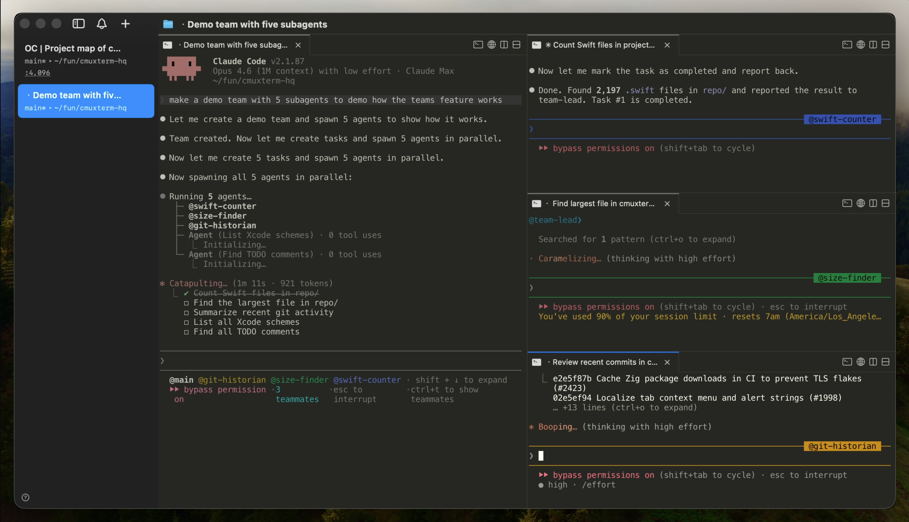
</td>
</tr>
</table>

- **Notification panel** — See all pending notifications in one place, jump to the most recent unread
- **Browser import** — Import cookies, history, and sessions from Chrome, Firefox, Arc, and 20+ browsers so browser panes start authenticated
- **Custom commands** — Define project-specific actions in [`cmux.json`](https://termloop.ai/docs/custom-commands) that launch from the command palette
- **Scriptable** — CLI and socket API to create workspaces, split panes, send keystrokes, and automate the browser
- **Native macOS app** — Built with Swift and AppKit, not Electron. Fast startup, low memory.
- **Ghostty compatible** — Reads your existing `~/.config/ghostty/config` for themes, fonts, and colors
- **GPU-accelerated** — Powered by libghostty for smooth rendering

## Install

### DMG (recommended)

<a href="https://github.com/feritzcan2/termloop/releases/latest/download/termloop-macos.dmg">
  
</a>

Open the `.dmg` and drag TermLoop to your Applications folder. TermLoop auto-updates via Sparkle, so you only need to download once.

### Homebrew

```bash
brew tap feritzcan2/termloop
brew install --cask termloop
```

To update later:

```bash
brew upgrade --cask termloop
```

On first launch, macOS may ask you to confirm opening an app from an identified developer. Click **Open** to proceed.

## Why TermLoop?

I run more AI coding agents than I have screens for — Claude Code, Codex, Gemini CLI, Aider — usually three or four at a time, on different branches, doing different work. The mismatch between how agents work and how terminals work was getting in the way.

A coding agent is asynchronous. It reads, thinks, edits, runs tests, comes back with a question, waits, runs more tests. While it's working, I want to be doing something else — code review, another agent, lunch. But standard terminals don't tell you which pane is asking for input. You alt-tab into the wrong pane, lose your place, and an agent has been blocked for ten minutes.

Worktrees are the right answer for parallel work — different branch, different directory, no stash gymnastics. But booting them by hand for every agent is friction. So TermLoop creates one per task, automatically, and tears it down when you merge.

Then there's the question of how agents talk to each other. When Claude gets stuck on something Codex is good at, it should ask Codex — not me. The `ask_to` MCP tool makes that a one-line call, cross-model, cross-worktree.

And the context. Every project has a `CLAUDE.md`, `AGENTS.md`, `GEMINI.md` somewhere. Most of them are stale or unused. The Context Bank scores them and lets you clone the strong ones across agents — so the next worker starts with the same memory the last one had.

The whole thing is a terminal, not a panel bolted onto an IDE. You bring your own subscription (Claude Code, Codex, Gemini CLI, etc.) — TermLoop never proxies your API traffic, never adds a billing layer, never locks you in. Built on top of [cmux](https://github.com/manaflow-ai/cmux), so the multiplexer, browser, and rendering foundation is solid; everything above the terminal is what TermLoop adds.

## Documentation

For more info on how to configure TermLoop, [head over to our docs](https://termloop.ai/docs/getting-started?utm_source=readme).

## Telemetry

This fork ships with crash reporting disabled by default.

- Enable it from `Settings -> App` if you want anonymized crash and app-hang reporting through the project's Sentry endpoint.
- Performance tracing and usage analytics stay disabled in this fork.
- Crash reports are configured with `sendDefaultPii = false`; file paths, document names, URL query strings, cookies, headers, screenshots, and view hierarchies are stripped before events are sent.
- Document contents and terminal contents are not sent as part of crash reporting.

## Keyboard Shortcuts

### Workspaces

| Shortcut | Action |
|----------|--------|
| ⌘ N | New workspace |
| ⌘ 1–8 | Jump to workspace 1–8 |
| ⌘ 9 | Jump to last workspace |
| ⌃ ⌘ ] | Next workspace |
| ⌃ ⌘ [ | Previous workspace |
| ⌘ ⇧ W | Close workspace |
| ⌘ ⇧ R | Rename workspace |
| ⌘ B | Toggle sidebar |

### Surfaces

| Shortcut | Action |
|----------|--------|
| ⌘ T | New surface |
| ⌘ ⇧ ] | Next surface |
| ⌘ ⇧ [ | Previous surface |
| ⌃ Tab | Next surface |
| ⌃ ⇧ Tab | Previous surface |
| ⌃ 1–8 | Jump to surface 1–8 |
| ⌃ 9 | Jump to last surface |
| ⌘ W | Close surface |

### Split Panes

| Shortcut | Action |
|----------|--------|
| ⌘ D | Split right |
| ⌘ ⇧ D | Split down |
| ⌥ ⌘ ← → ↑ ↓ | Focus pane directionally |
| ⌘ ⇧ H | Flash focused panel |

### Browser

Browser developer-tool shortcuts follow Safari defaults and are customizable in `Settings → Keyboard Shortcuts`.

| Shortcut | Action |
|----------|--------|
| ⌘ ⇧ L | Open browser in split |
| ⌘ L | Focus address bar |
| ⌘ [ | Back |
| ⌘ ] | Forward |
| ⌘ R | Reload page |
| ⌥ ⌘ I | Toggle Developer Tools (Safari default) |
| ⌥ ⌘ C | Show JavaScript Console (Safari default) |

### Notifications

| Shortcut | Action |
|----------|--------|
| ⌘ I | Show notifications panel |
| ⌘ ⇧ U | Jump to latest unread |

### Find

| Shortcut | Action |
|----------|--------|
| ⌘ F | Find |
| ⌘ G / ⌘ ⇧ G | Find next / previous |
| ⌘ ⇧ F | Hide find bar |
| ⌘ E | Use selection for find |

### Terminal

| Shortcut | Action |
|----------|--------|
| ⌘ K | Clear scrollback |
| ⌘ C | Copy (with selection) |
| ⌘ V | Paste |
| ⌘ + / ⌘ - | Increase / decrease font size |
| ⌘ 0 | Reset font size |

### Window

| Shortcut | Action |
|----------|--------|
| ⌘ ⇧ N | New window |
| ⌘ , | Settings |
| ⌘ ⇧ , | Reload configuration |
| ⌘ Q | Quit |

## Nightly Builds

[Download TermLoop NIGHTLY](https://github.com/feritzcan2/termloop/releases/download/nightly/termloop-nightly-macos.dmg)

TermLoop NIGHTLY is a separate app with its own bundle ID, so it runs alongside the stable version. Built automatically from the latest `main` commit and auto-updates via its own Sparkle feed.

Report nightly bugs on [GitHub Issues](https://github.com/feritzcan2/termloop/issues) or [GitHub Discussions](https://github.com/feritzcan2/termloop/discussions).

## Session restore (current behavior)

On relaunch, TermLoop currently restores app layout and metadata only:
- Window/workspace/pane layout
- Working directories
- Terminal scrollback (best effort)
- Browser URL and navigation history

TermLoop does **not** restore live process state inside terminal apps. For example, active Claude Code/tmux/vim sessions are not resumed after restart yet.

## Star History

<a href="https://star-history.com/#feritzcan2/termloop&Date">
 <picture>
   <source media="(prefers-color-scheme: dark)" srcset="https://api.star-history.com/svg?repos=feritzcan2/termloop&type=Date&theme=dark" />
   <source media="(prefers-color-scheme: light)" srcset="https://api.star-history.com/svg?repos=feritzcan2/termloop&type=Date" />
   
 </picture>
</a>

## Contributing

Ways to get involved:

- Join the conversation on [GitHub Discussions](https://github.com/feritzcan2/termloop/discussions)
- Create and participate in [GitHub issues](https://github.com/feritzcan2/termloop/issues) and [discussions](https://github.com/feritzcan2/termloop/discussions)
- Let us know what you're building with TermLoop

## Founder's Edition

TermLoop is free, open source, and always will be. If you'd like to support development and get early access to what's coming next:

**[Get Founder's Edition](https://buy.stripe.com/3cI00j2Ld0it5OU33r5EY0q)**

- **Prioritized feature requests/bug fixes**
- **Early access: TermLoop AI that gives you context on every workspace, tab and panel**
- **Early access: iOS app with terminals synced between desktop and phone**
- **Early access: Cloud VMs**
- **Early access: Voice mode**
- **My personal iMessage/WhatsApp**

## License

TermLoop is open source under [GPL-3.0-or-later](./termloop/LICENSE).

If your organization cannot comply with GPL, a commercial license is available. Contact [feritzcan93@gmail.com](mailto:feritzcan93@gmail.com) for details.
