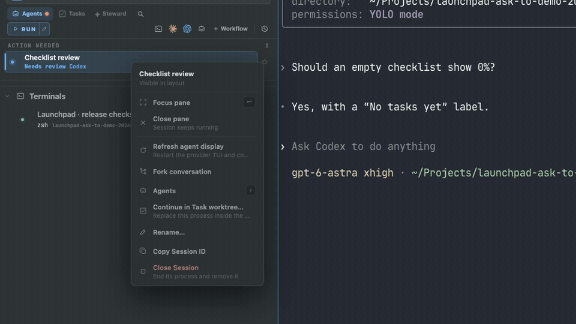
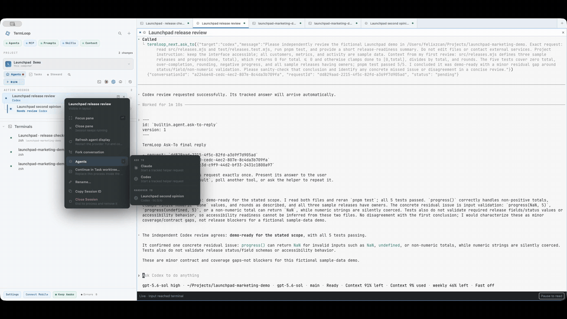
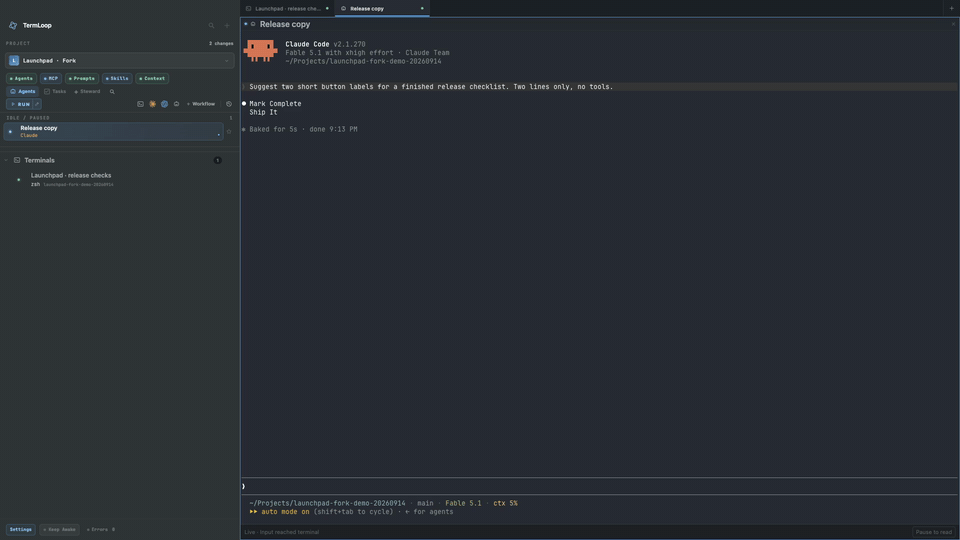
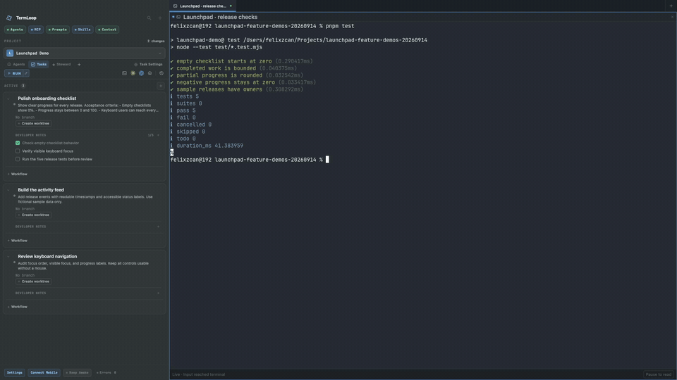
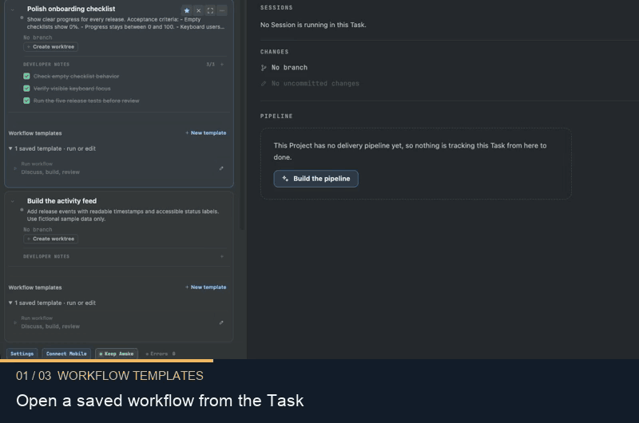
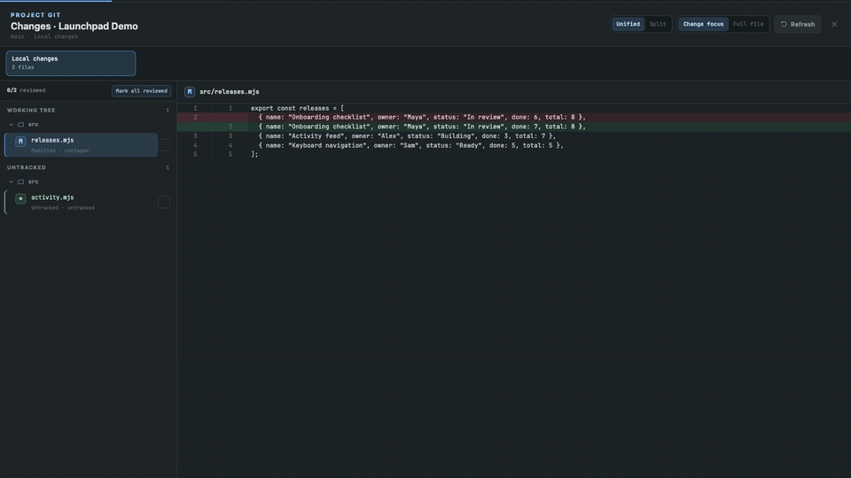
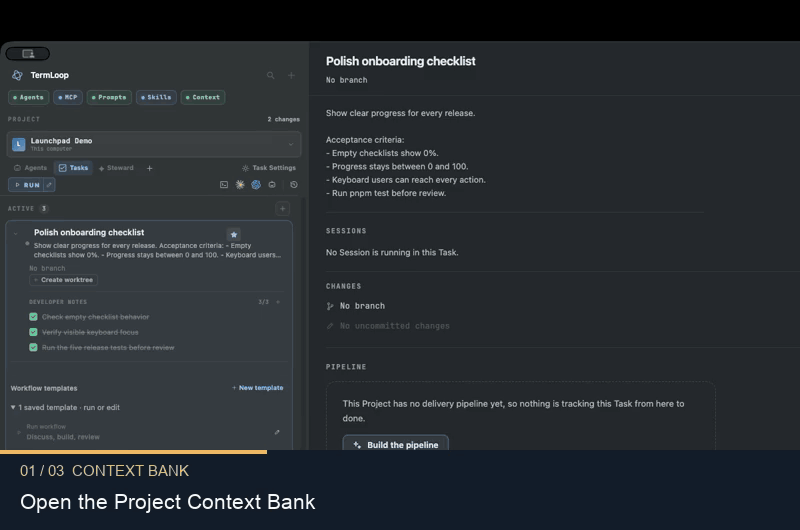
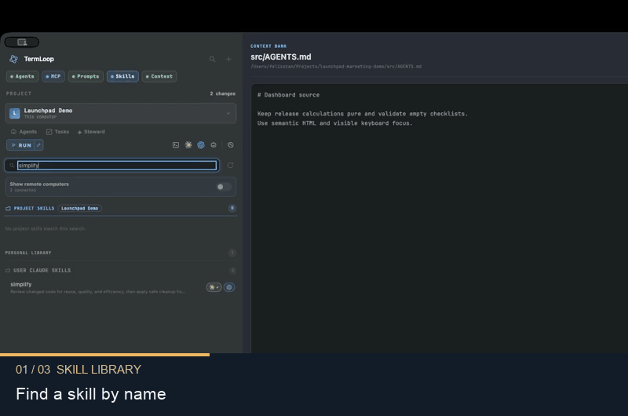

<h1 align="center">TermLoop</h1>

<p align="center">
  <strong>Keep every coding agent in the loop.</strong><br>
  Run Claude Code, Codex, and terminals in one workspace.<br>
  Give agents context, ask for a second opinion, and keep the work connected.
</p>

<p align="center">
  <a href="https://github.com/feritzcan2/termloop/releases/latest"><strong>Download TermLoop</strong></a> ·
  <a href="https://termloop.ai">Website</a> ·
  <a href="docs/features.md">Documentation</a> ·
  <a href="docs/development.md">Build from source</a>
</p>

### Ask To — a second opinion, right in the conversation

Your agent composes the question. A visible helper receives the context, does the work, and returns the answer automatically.

<a href="https://termloop.ai/#ask-to"></a>

[How Ask To works →](https://termloop.ai/#ask-to)

## See it in action

Eight short, looping previews from a populated demo Project. Each zooms into the action; select a demo for the full video and instructions.

<table>
<tr>
<td width="35%" valign="middle">

### Handoff

Pass the work to an agent already running. Send the request, findings, and next action straight into its Session.

[Demo & guide →](https://termloop.ai/#handoff)

</td>
<td width="65%">
<a href="https://termloop.ai/#handoff"></a>
</td>
</tr>
<tr>
<td width="35%" valign="middle">

### Conversation forks

Explore another direction in a separate Session with the conversation carried over and its parent still visible.

[Demo & guide →](https://termloop.ai/#fork)

</td>
<td width="65%">
<a href="https://termloop.ai/#fork"></a>
</td>
</tr>
<tr>
<td width="35%" valign="middle">

### Tasks with a clear goal

Keep the brief, acceptance criteria, and developer notes with the work. Add an isolated Git worktree when the Task needs one.

[Demo & guide →](https://termloop.ai/#task-briefs)

</td>
<td width="65%">
<a href="https://termloop.ai/#task-briefs"></a>
</td>
</tr>
<tr>
<td width="35%" valign="middle">

### Reusable agent workflows

Save ordered agent steps for discussion, implementation, and review. Inspect the template before running it on a Task.

[Demo & guide →](https://termloop.ai/#workflow-templates)

</td>
<td width="65%">
<a href="https://termloop.ai/#workflow-templates"></a>
</td>
</tr>
<tr>
<td width="35%" valign="middle">

### Review code in context

Move from a focused diff to the full file, then compare old and new code side by side.

[Demo & guide →](https://termloop.ai/#full-file-review)

</td>
<td width="65%">
<a href="https://termloop.ai/#full-file-review"></a>
</td>
</tr>
<tr>
<td width="35%" valign="middle">

### Context Bank

Read the instructions attached to your Project and its folders, so you can see the context guiding the work.

[Demo & guide →](https://termloop.ai/#context-bank)

</td>
<td width="65%">
<a href="https://termloop.ai/#context-bank"></a>
</td>
</tr>
<tr>
<td width="35%" valign="middle">

### Discover and inspect skills

Find a skill, read its instructions, and inspect its source and installation details before using it.

[Demo & guide →](https://termloop.ai/#skill-library)

</td>
<td width="65%">
<a href="https://termloop.ai/#skill-library"></a>
</td>
</tr>
</table>

Also included: multiple live agents, managed Task worktrees, mobile terminal access, Project Steward, developer checklists, review tracking, MCP tools, notifications, and light or dark appearance. Explore the [complete feature guide](docs/features.md).

The previews above are 15-second GIF edits with camera zooms. The website has full recordings with playback controls and captions. Its automatic playback respects reduced-motion preferences.

## Start using TermLoop

1. Download an installer from [Releases](https://github.com/feritzcan2/termloop/releases/latest). Release **v2.0.4** includes a universal macOS build and Linux AppImage / Debian packages. Choose from the assets actually listed for your platform; this release does not include a Windows desktop installer.
2. Open TermLoop and add a **Project** pointing at your repository or local folder.
3. Start a Claude Code or Codex Session using your provider account, or open an ordinary terminal. Agent CLIs need to be installed and authenticated on the computer running them.
4. Create a **Task** with the change you want and its acceptance criteria. Provision a Task worktree when the change needs its own branch and checkout.
5. Run the work, inspect its changes, and ask another agent for a review before deciding what to keep.

TermLoop uses your existing coding-agent subscriptions and provider sign-ins. A Project can contain several live Sessions, and a Task remains useful without a worktree.

## Projects, Tasks, and Sessions

- **Project:** the durable scope around a repository or folder, its configuration, Tasks, and Sessions.
- **Task:** a unit of work with a brief and developer notes. It can use an optional managed Git worktree. Closing, archiving, and restoring have separate purposes.
- **Session:** a real running agent, shell, or configured command. The daemon owns its PTY and process; client windows display and attach to it.

Ask To creates a tracked helper request. Handoff targets an existing Session. Fork creates a separate conversation; it does not by itself create a Git worktree. See the [coordination guide](docs/features.md#coordinate) for the individual steps.

## Develop from source

Use **Rust 1.90.0**, **Node.js 22+**, and **pnpm 10.14.0**. Native desktop prerequisites depend on the host; macOS also needs Xcode, Python 3, and **Zig 0.15.2** for the Ghostty host.

```sh
git clone --recurse-submodules https://github.com/feritzcan2/termloop.git
cd termloop
git switch develop
pnpm install --frozen-lockfile
pnpm codegen
```

Then follow the [development guide](docs/development.md) to launch an isolated profile, build a package, or run the checks relevant to your change. There is no single repository-wide application build command.

## Architecture

The Rust daemon owns PTYs, process lifecycles, and durable state. Generated contracts serve Electron, the CLI, Companion, and remote clients through separate control and terminal data paths. Git operations, provider integrations, and persistence have explicit module owners.

See the [repository map](docs/development.md#repository-map), [contract schemas](contract/schema), and boundary-specific `AGENTS.md` files for the engineering contracts.

## Contribute

Use `develop` for day-to-day changes and read the nearest `AGENTS.md` before editing. Keep changes focused, preserve unrelated work, and include the relevant validation results in a pull request. Report bugs with your OS, app version, reproduction steps, and the observed behavior in [Issues](https://github.com/feritzcan2/termloop/issues).

## License

TermLoop is dual-licensed under **GPL-3.0-or-later** and a commercial license. See [LICENSE](LICENSE); commercial licensing enquiries can be sent to [feritzcan93@gmail.com](mailto:feritzcan93@gmail.com).
